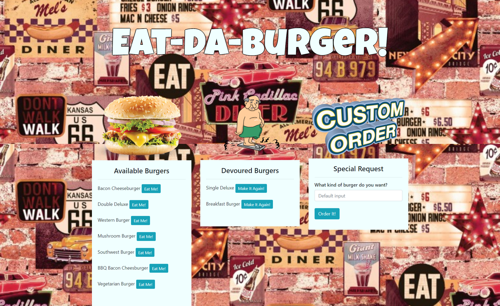

# Eat-Da-Burger!!

### This was a homework assignment for the UCF Coding Boot Camp. In this assignment we are using Node.js, Express.js, Handlebars.js, and a mySQL database to create an application that has the ability to Create, Read, and Update the database using client side interaction. The fianl product also has to be deployed on Heroku.
---

## Screenshot

## Technologies Used
* JavaScript
* jQuery
* Node.js
* Express.js
* Handlebars.js
* mySQL Database
* NPM Packages
    * mysql
    * body-parser
    * express
    * express-handlebars
* HTML
* CSS
* BootStrap
* DBeaver
* Google Fonts
* Heroku
    * Jaws_DB
* Visual Studio Code
* Postman

## Try My Application - Eat-Da-Burger!!
https://polar-reaches-59265.herokuapp.com/